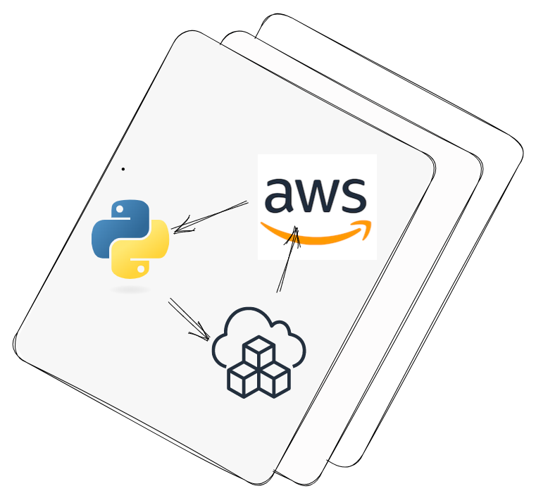

## A no-cost AWS infrastructure boilerplate for Python (Django) API

<b>The only thing you need to pay for is Secret Manager (1$ monthly for each secret).  
Only works using free tiers, for accounts less than a year old.</b>


The project's aim is to create a reusable boilerplate for 
faster development and validation of MVP-type projects. 
The project utilizes the Cloud Development Kit ([CDK](https://aws.amazon.com/cdk/)), 
which enables the definition of infrastructure 
through a programming language (such as Python or JavaScript). 
Since the project is based on Django, which is in Python, the infrastructure is also written in this language.

### Why
Creating this boilerplate, I wanted my solution to be scalable and 
have no limits that may arise when using other libraries/frameworks. 
I use CDK because it is a native solution that is much more convenient 
than YAML files that need to be created for CloudFormation.

---
### Technologies
- python
- aws
- cdk
- jq
- docker
- docker-compose
- pre-commit: black, flake8, isort
- django; django-rest-framework
- ...

---
### AWS Services
Fully deployed project uses:
- RDS (postgres, T3 MICRO)
- S3 bucket (for static files, images or/and django-admin)
- Lambda (DockerImage with 3 MB of memory and 60 second timeout by default)
- ECR (keeps only 2 newest images)
- API Gateway
- RDS secrets (generated automatically)
- Other secrets (like `DJANGO_SECRET_KEY`, generated manually)

---
### Requirements:
```
make -v 
GNU Make 4.3


docker -v
Docker version 24.0.5, build 24.0.5-0ubuntu1~22.04.1


docker-compose -v
docker-compose version 1.29.2, build unknown


pip freeze | grep cookiecutter
cookiecutter==2.5.0


aws --version
aws-cli/2.11.15 


jq -V
jq-1.6


cdk --version
2.90.0 (build 8c535e4)
```

---
### Structure
For django structure check this [styleguide](https://github.com/HackSoftware/Django-Styleguide).
- `{{cookiecutter.project_name}}-backend` - holds API and CDK code
- `{{cookiecutter.project_name}}-backend/src/backend` - django place     
- `{{cookiecutter.project_name}}-backend/Makefile` - helpful commands to manage app development
- `{{cookiecutter.project_name}}-backend/infra` - CDK code, that creates lambda and apigateway
- `{{cookiecutter.project_name}}-backend/infra/Makefile` - helpful commands for deploy management
- `{{cookiecutter.project_name}}-prereq` - 
holds CDK code, that creates RDS, ECR and S3 bucket. 
It is deployed only once per project.
- `{{cookiecutter.project_name}}-backend/infra/Makefile` - helpful commands for deploy management
 

---
### Project creation
```
pip install cookiecutter
cookiecutter gh:baxiee/django-cdk-boilerplate
  [1/3] project_name (foo-project): foo-project     (name for both project and aws credentials)      
  [2/3] certificate_arn ():         cert-xxxxxx     (your domain certificate [optional])
  [3/3] domain ():                  foo-domain.com  (your domain url [optional]) 
```
I will keep `foo-project` as my project name for this guide.

---
### Local development
The entire project uses docker and docker-compose.  
There are two images: PostgreSQL and the Django backend. 
All elements used for running the local environment 
can be found in `foo-project-backend/local`. 

---
#### Initial configuration
I treat backend and prereq as separated repositories. For each I initialize git and pre-commmit. 
```
pwd # foo-project 
(cd foo-project-backend && git init && pre-commit install)
(cd foo-project-prereq && git init && pre-commit install)
```

---
#### Virtual Env configuration
```
pwd # foo-project
python -m venv venv
source venv/bin/activate
pip install -r foo-project-backend/requirements.txt 
```
Add this venv as `Python Interpreter` in your IDE.

---
#### File hierarchy  
I mark `foo-project-backend/src/backend` as `Sources Root`.  
Also I exclude all `venv` folders from Pycharm's indexing.


---
#### Makefiles
Each repository has one or two Makefile files. 
They are available either in the main project root or in the infra directory. 
The commands found there are self-descriptive. 
We will use a few command through this guide.

---
#### Containers
Initial run and migrations
```
pwd # foo-project-backend
make upbuild
```


Example endpoint - `/api/users/`


---
#### Migrations
If you change something in model and want to prepare migrations just run command.
```
pwd # foo-project-backend
make makemigrations
```
  

Each time you want migrate your models into database, you only need to re-build containers.
```
pwd # foo-project-backend
make upbuild
```

---
### AWS deployment
#### Credentials configuration
Open AWS credentials file
```
sudo nano ~/.aws/credentials
```
Add new profile
```
[foo-project]
aws_access_key_id = YOUR_KEY
aws_secret_access_key = YOUR_SECRET
region = PROJECT_TARGET_REGION  
```

---
#### Create secret
```
pwd # foo-project-prereq/infra
make create-django-secret
```


---
#### Deploy prereq
Prereq creates RDS, S3 and ECR assets.
```
pwd # foo-project-prereq/infra
make bootstrap-prereq
make deploy-prereq
```
<sub>Remember to mark all cdk.out and venv as excluded in your IDE.</sub>

---
#### Deploy backend
Backend creates api gatewway, docker image and lambda.
```
pwd # foo-project-backend/infra
make deploy-backend
```
<sub>Remember to mark all cdk.out and venv as excluded in your IDE.</sub>


---
#### Migrations
```
pwd # foo-project-backend/infra
make migrate
```


---
#### Code changes
When you change the code and be ready are to deploy, you need only to run this command.
```
pwd # foo-project-backend/infra
make deploy-backend
```

---
#### Final
Final check of API


---
### Destroying
Firstly destroy backend stack.
```
pwd # foo-project-backend/infra
make destroy-backend
```
By default RDS has deletion protection, before we delete prereq stack, we need to disable this protection.
```
pwd # foo-project-prereq/infra
make modify-rds
```
Then you can remove prereq stack
```
pwd # foo-project-prereq/infra
make destroy-prereq
```
The last one step is to remove S3 bucket and ECR
```
pwd # foo-project-prereq/infra
make remove-s3-ecr
```

